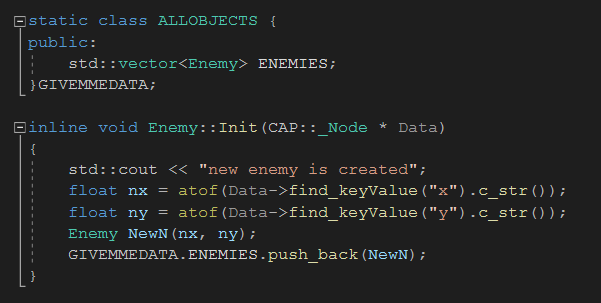

# SFML-TileEditor

This project is open source .

### Major_PATCH 19/11/2022:
  + All Game OBJECTS are now defined by the Class _Object   
  and they must have a Constructor, get_CLass that returns the name of the object   
  and an outside defined function named Init that you will use to create new objects of that type   
  ! Note that we use a class that stores all the Object vectors and we must set it as static    
  because of warning erros   
  ! To actually access the Class, you must create an object right after it (GIVEMEDATA)   
   

### Update 17/11/2022 :
  + You can now create your own Classes and customize how the    
    object is made in ALL_OBJECTS_CLASS    
    Give the object a class tag and the function it will use on create   
    (Do not change anything in H_object.cpp)
    

### Update 16/11/2022 :
  + Solved the find_keyValue String error
  + Solved the map loading vector error    
      (Now the map will be constructed and then checked with load.   
      it will return 1 if the map was found and loaded succesfully.   
      0 if the map has had any problems loading  ).
  + It can load maps that contain only objects and no tiles
  + Now you can set the objects in Tiles in the object section
    by defining its class in the properties

### Update 6/4/2022 : 
  + added the availabity to use xml files that contain comments
  + fixed the tag missmatch caused by the nodes without attributes 
